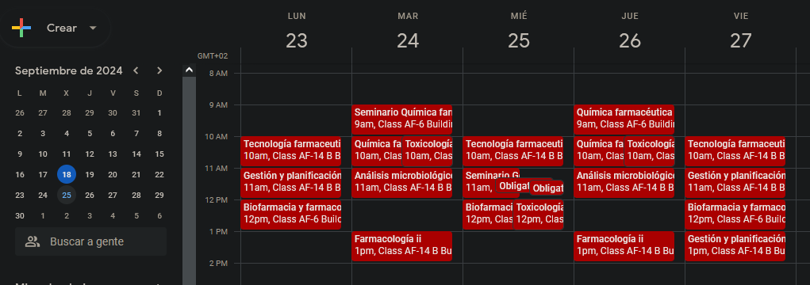
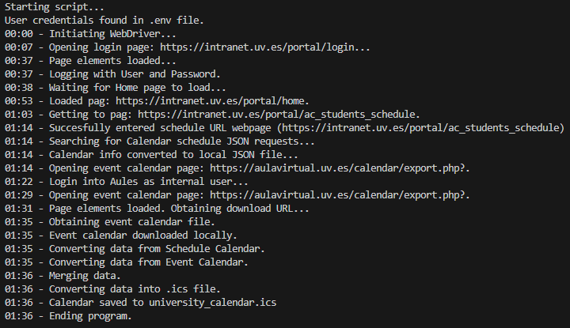

# Description
Web scrapper for obtaining the dynamic class schedule for the University of Valencia, due to as of 18/9/24 not having API nor export option to obtain it.

## Differences with old manual import
The result is very similar to what it was with the manual import from the file that was given by the old platform of the University. 

Still, there are differences that make this option superior:
- This method displays the importance of Seminars and Lab Sessions by indicating them before the name of the Subject.
- This also obtains the calendar from the events that are created by the professors (exams, tests, assignments...).
- The events dont display Subject and Group IDs, which clutter the view of the Calendar.

Resulting calendar in Google Calendar:

# Table of Contents
- [Description](#description)
  - [Differences with old manual import](#differences-with-old-manual-import)
- [Table of Contents](#table-of-contents)
- [Installation](#installation)
- [Usage](#usage)

# Installation
The .exe file can be downloaded through the latest [release page](https://github.com/LoloCG/UV_Calendar_scrapper/releases/), or directly [here](https://github.com/LoloCG/UV_Calendar_scrapper/releases/download/v1.0/main.exe)

# Usage
Once 
Example terminal output (from VSCode):

